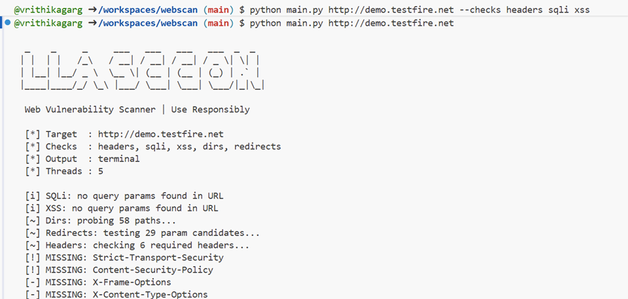
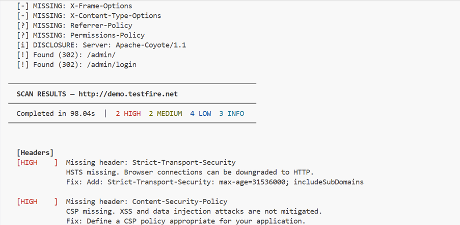
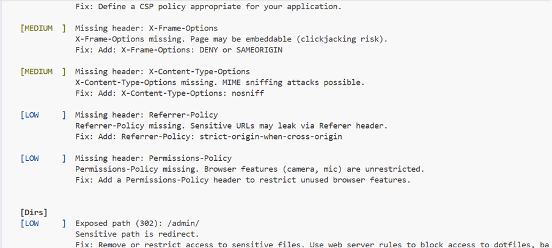
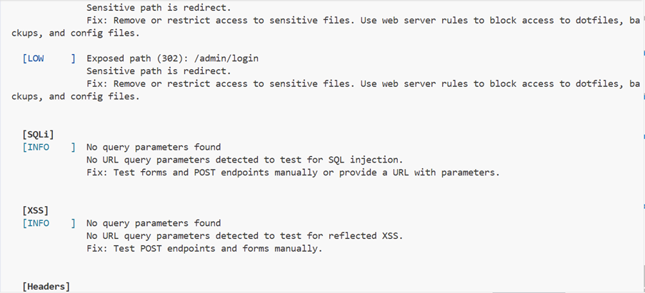
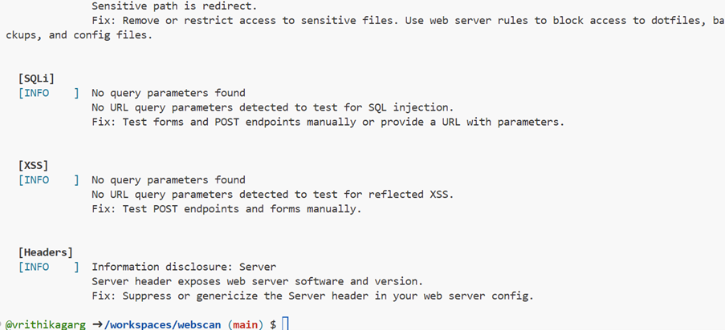

# WebScan — Web Vulnerability Scanner

A modular command-line web vulnerability scanner written in Python. Built as a portfolio project to demonstrate offensive security concepts and structured Python tooling.

> ⚠️ **Legal Disclaimer**: Only use this tool against systems you own or have explicit written authorization to test. Unauthorized scanning is illegal and unethical.

---

## Features

| Module | What it checks |
|--------|---------------|
| **Headers** | Missing/misconfigured security headers (HSTS, CSP, X-Frame-Options, etc.) |
| **SQLi** | Error-based SQL injection via URL parameter fuzzing |
| **XSS** | Reflected XSS via payload reflection in query parameters |
| **Dirs** | Sensitive file/directory enumeration (`.env`, `.git`, backups, admin panels) |
| **Redirects** | Open redirect via common redirect parameter fuzzing |

**Output formats:** terminal (colored), JSON, HTML report

---

## Installation

```bash
git clone https://github.com/yourusername/webscan.git
cd webscan
pip install -r requirements.txt
```

**Requirements:** Python 3.8+, `requests`

---

## Usage

```bash
# Run all checks against a target
python scanner.py https://example.com

# Run specific checks only
python scanner.py https://example.com --checks headers dirs

# Test a URL with query parameters for SQLi and XSS
python scanner.py "https://example.com/search?q=test" --checks sqli xss

# Save an HTML report
python scanner.py https://example.com --output html --outfile report.html

# Save a JSON report (good for CI/CD pipelines)
python scanner.py https://example.com --output json --outfile results.json

# Verbose mode shows all checks including passing ones
python scanner.py https://example.com --verbose

# Adjust request speed (be polite to servers)
python scanner.py https://example.com --delay 1.0 --threads 3
```

### All options

```
usage: scanner.py [-h] [--checks {headers,sqli,xss,dirs,redirects,all} [...]]
                  [--output {terminal,json,html}] [--outfile OUTFILE]
                  [--timeout TIMEOUT] [--delay DELAY] [--threads THREADS]
                  [--verbose]
                  target
```

---

## Project Structure

```
webscan/
├── scanner.py              # Entry point / CLI
├── requirements.txt
├── README.md
└── scanner/
    ├── __init__.py
    ├── core.py             # Orchestrates all checks, threading
    ├── report.py           # Terminal / JSON / HTML output
    └── checks/
        ├── __init__.py
        ├── headers.py      # Security header analysis
        ├── sqli.py         # SQL injection probing
        ├── xss.py          # Reflected XSS probing
        ├── dirs.py         # Directory/file enumeration
        └── redirects.py    # Open redirect probing
```

---

## Example Output

```
  [Headers]
  [HIGH    ]  Missing header: Strict-Transport-Security
               HSTS missing. Browser connections can be downgraded to HTTP.
               Fix: Add: Strict-Transport-Security: max-age=31536000; includeSubDomains

  [HIGH    ]  Missing header: Content-Security-Policy
               CSP missing. XSS and data injection attacks are not mitigated.

  [Dirs]
  [HIGH    ]  Exposed path (200): /.env
               High-value file — may contain credentials or secrets.
               Fix: Remove or restrict access to sensitive files.

  [HIGH    ]  Exposed path (200): /.git/config
               Sensitive path is accessible.
```

---

## Extending WebScan

Adding a new check module is straightforward:

1. Create `scanner/checks/mycheck.py` with a function `check_mycheck(target, timeout, delay, **kwargs) -> list[dict]`
2. Each finding dict should have keys: `check`, `severity`, `title`, `description`, `recommendation`, `evidence`
3. Register it in `scanner/core.py`'s `CHECK_MAP`
4. Add it to the `--checks` argument choices in `scanner.py`

---

## Roadmap

- [ ] POST body fuzzing for SQLi/XSS
- [ ] Cookie/header injection probing
- [ ] Subdomain enumeration module
- [ ] Time-based blind SQLi detection
- [ ] SSRF probing module
- [ ] Docker container for isolated scanning
- [ ] CI/CD integration mode (exit code based on severity threshold)

---

## Learning Resources

- [OWASP Top 10](https://owasp.org/www-project-top-ten/)
- [PortSwigger Web Security Academy](https://portswigger.net/web-security)
- [HackTheBox](https://www.hackthebox.com/) — practice on legal targets

---

## License

MIT License — see `LICENSE`

**## Expected Output**









